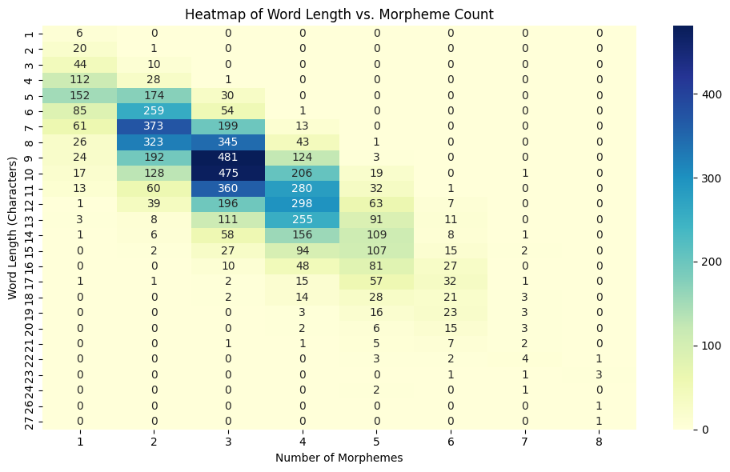
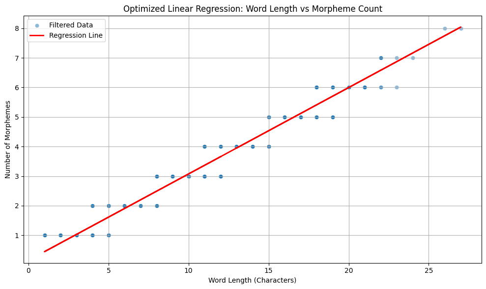
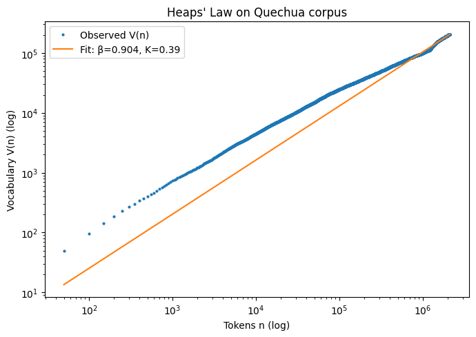
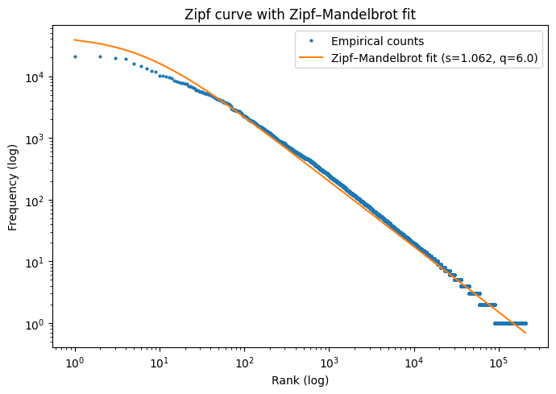

# Quechua Morphological Segmentation

> **Supervised Morphological Segmentation for Southern Quechua: Priors, Filters, and LLM Augmentation**

A comprehensive toolkit for morphological segmentation of Southern Quechua, featuring neural architectures augmented with linguistically-informed priors.

## అ Results Summary

### Test Set Results (913 words)

| Model | EM | +Filter | B-F1 |
|-------|:--:|:-------:|:----:|
| Transformer Seq2Seq | 43.2% | — | — |
| BiLSTM (Character) | 52.7% | — | 0.817 |
| BiLSTM (Grapheme) | 56.1% | — | 0.840 |
| BiLSTM + Morfessor | 55.1% | — | 0.838 |
| BiLSTM + DT Prior | 54.1% | 64.8% | 0.815 |
| BiLSTM + HMM Prior | 57.4% | 66.6% | 0.822 |
| **BiLSTM + HMM + GPT-4o (200)** | **63.9%** | **74.2%** | **0.898** |

**EM** = Exact Match accuracy, **+Filter** = with rejection filter, **B-F1** = Boundary F1 (without filter)

### Cross-Validation Results (5-fold)

| Model | CV EM | CV B-F1 |
|-------|:-----:|:-------:|
| Transformer Seq2Seq | 60.5 ± 1.5% | — |
| BiLSTM-CRF | 84.9 ± 1.5% | — |
| BiLSTM + DT Prior | 84.2 ± 1.6% | 0.960 ± 0.004 |
| BiLSTM + HMM Prior | 85.8 ± 1.2% | 0.952 ± 0.005 |

### Key Findings

1. **BiLSTM > Transformer**: BiLSTM-based models substantially outperform Transformers (+13.9% EM), confirming that inductive biases matter in low-resource settings.

2. **Grapheme tokenization helps**: Respecting Quechua digraphs (ch, ll, ph, etc.) provides modest but consistent gains (+3.4% EM).

3. **Linguistic priors improve**: The HMM suffix prior achieves 57.4% vs 56.1% for the grapheme baseline (+1.3%).

4. **Rejection filters are crucial**: Hard morphotactic constraints at inference provide +9.2% EM improvement.

5. **LLM augmentation is effective**: GPT-4o with 200 synthetic examples yields our best result (74.2% EM).

6. **GPT-4o > GPT-5 for this task**: Instruction-following fidelity matters more than raw capability for narrow morphological tasks.

## ఆ Architecture

```
Raw Word → Grapheme Tokenizer → BiLSTM Encoder → Boundary Logits → Rejection Filter → Segmented Word
                                      ↑
                              HMM/DT Prior (soft)
```

The system combines:
- **Soft priors** (HMM or Decision Tree) during training via logit-level fusion
- **Hard constraints** (suffix rejection filter) at inference

## ఇ Repository Structure

```
quechua-segmentation/
├── src/
│   ├── __init__.py          # Package exports
│   ├── preprocessing.py     # Tokenization, normalization
│   ├── models.py            # Neural architectures & priors
│   ├── evaluation.py        # Metrics & evaluation utilities
│   └── training.py          # Training loops & checkpoints
├── notebooks/               # Original Jupyter notebooks
├── images/                  # Figures and visualizations
├── data/                    # Data files (see Data section)
├── models/                  # Trained model checkpoints
└── README.md
```

## ఈ Quick Start

### Installation

```bash
pip install torch numpy pandas scikit-learn morfessor regex
```

### Basic Usage

```python
from src import (
    to_graphemes, 
    BiLSTMBoundary, 
    HMMSuffixPrior,
    SuffixRejectionFilter,
    apply_boundaries
)

# Tokenize a word
tokens = to_graphemes("rikuchkani")
# ['r', 'i', 'k', 'u', 'ch', 'k', 'a', 'n', 'i']

# Load trained model and predict
model = BiLSTMBoundary(vocab_size=42, emb_dim=64, hidden_size=128)
# ... load weights ...

# Apply HMM prior
hmm_prior = HMMSuffixPrior()
hmm_prior.fit(training_morph_splits)
prior_probs = hmm_prior.predict_probs(tokens)

# Get predictions and apply filter
boundary_labels = [0, 0, 0, 1, 0, 0, 1, 0]  # from model
segments = apply_boundaries(tokens, boundary_labels)
# ['riku', 'chka', 'ni']

# Rejection filter
filter = SuffixRejectionFilter(suffix_vocabulary)
filtered = filter.filter("rikuchkani", segments)
```

## ఉ Data

### Training Data (Private)
- **6,896 unique words** from interview transcriptions with ~70 adult Quechua speakers
- Collected under IRB approval with informed consent
- Annotated by two community elder consultants
- Available on request in de-identified form under controlled access conditions

### Test Data (Public)
- **913 unique words** held out before training
- Released with this repository

### Corpus Statistics

Our training data exhibits strong correlation between word length and morpheme count (Pearson r = 0.79, p < 0.001):



*Heatmap showing the relationship between word length (characters) and number of morphemes. The diagonal pattern reflects Quechua's bisyllabic root constraint and regular suffixation.*



*Linear relationship: morphemes ≈ 0.28 × length + 0.32 (R² = 0.63)*

For the public crawl corpus (~2.1M tokens, 206K types):



*Vocabulary growth follows Heaps' law with β = 0.90 (R² = 0.98), indicating continued productivity.*



*Word frequency distribution with Zipf-Mandelbrot fit (s = 1.06, q = 6.0).*

## ఊ Models

### BiLSTM Boundary Tagger
Character/grapheme-level BiLSTM with per-position boundary prediction.

```python
from src.models import BiLSTMBoundary

model = BiLSTMBoundary(
    vocab_size=42,
    emb_dim=64,
    hidden_size=128,
    num_layers=2,
    dropout=0.1
)
```

### BiLSTM with Linguistic Priors
Integrates HMM or Decision Tree priors via logit-level fusion.

```python
from src.models import BiLSTMWithPrior, HMMSuffixPrior

prior = HMMSuffixPrior(max_suffix_len=8)
prior.fit(morph_splits)

model = BiLSTMWithPrior(vocab_size=42, prior_alpha=1.0)
```

### Rejection Filter
Post-processing validation against known suffix vocabulary.

```python
from src.models import SuffixRejectionFilter

filter = SuffixRejectionFilter(suffix_set)
valid = filter.validate(["riku", "chka", "ni"])  # True
valid = filter.validate(["ri", "ku", "xyz"])     # False
```

## ఋ LLM Augmentation

We use GPT-4o to generate synthetic training examples:

1. **Candidate selection**: Words from public Quechua corpus matching root patterns in training data
2. **Few-shot prompting**: 37 demonstration pairs, temperature=0
3. **Validation**: Reject outputs containing English words or incorrect format
4. **Optimal quantity**: 200 examples (more can hurt performance)

The pipeline respects data governance by not exposing private training data to external APIs.

## ౠ Citation

```bibtex
@inproceedings{anonymous2026quechua,
  title={Supervised Morphological Segmentation for Southern Quechua: 
         Priors, Filters, and LLM Augmentation},
  author={Anonymous},
  booktitle={Proceedings of ACL 2026},
  year={2026}
}
```

## ఎ Ethics & Data Governance

- Training data collected under IRB approval with informed consent
- Community elders served as annotators with fair compensation at US rates
- We honor indigenous data sovereignty principles (CARE)
- Private data is not exposed to external APIs
- Public release prioritizes language maintenance and education applications

## ఏ License

Code is released under MIT License. The 913-word test set is released for research purposes.

## ఐ Acknowledgments

We thank the Quechua-speaking communities who contributed linguistic data and expertise, and the community elder consultants who provided annotations.
